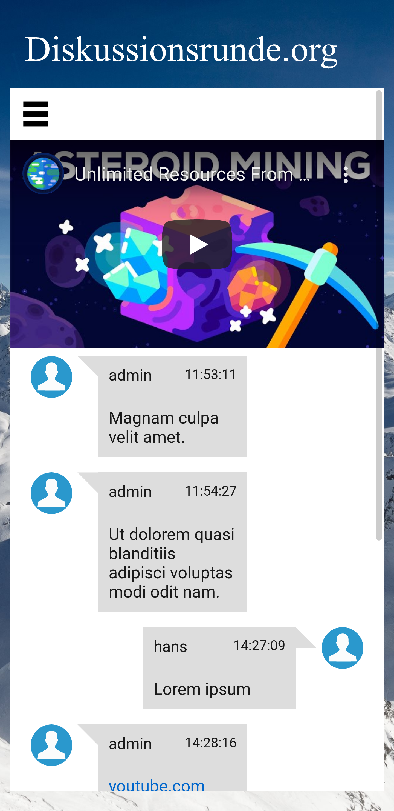

### Social media site for discussing politics

##### Overview

##### Features

- Profile	
	- User status
	- Basic privacy settings
	- Visual configuration
	- Personal message
	- Multi language support
- Communication
	- Friend system
	- Direct messages
	- Group messages
	- Events (work in progress)
	- Highlighted links and image preview
- Tech
	- Asynchronous site updates via ajax

##### Setup

1. `git clone` this repo
2. Start docker: `sudo systemctl start docker`
3. `cd diskussionsrunde`
4. `sudo docker-compose up`
5. Import `data/backup/u233310313_data.sql` in phpmyadmin (`localhost:8080`)
7. Create an account (`localhost`) -> [Register]
	- Default token: `TOKEN`
8. Login

##### Troubleshooting

Error reporting in php can be enabled by removing `error_reporting(0);` in `www/php/variables.php`.

##### Built with: https://github.com/sprintcube/docker-compose-lamp

##### Legal

All code contained in sprintcube's repository is licensed with the [https://mit-license.org/](https://mit-license.org/) license.